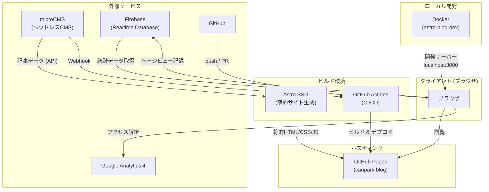
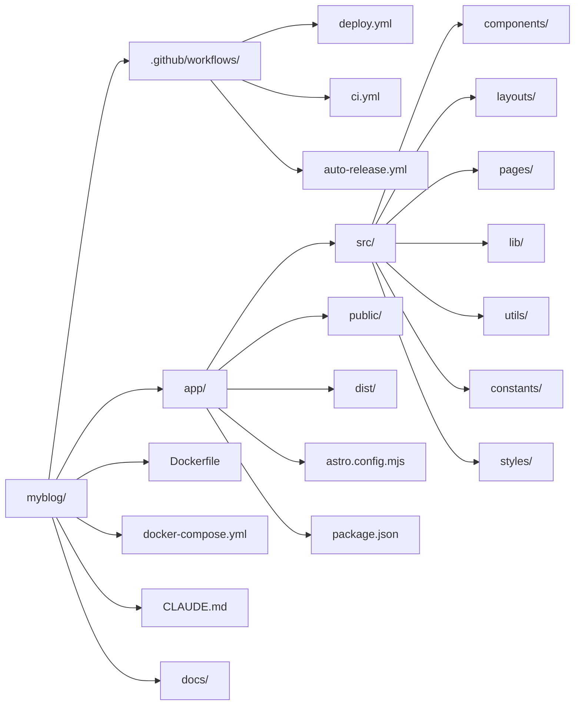
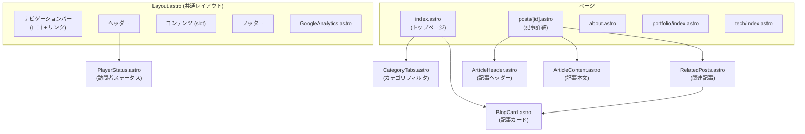
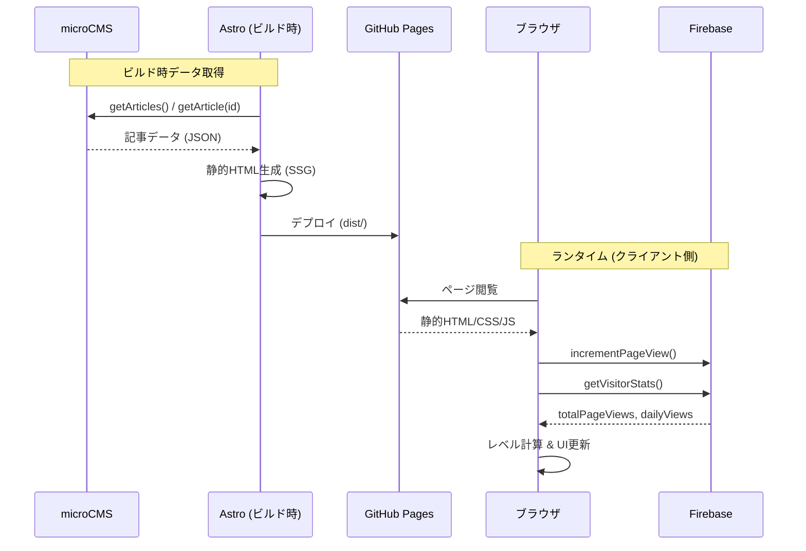
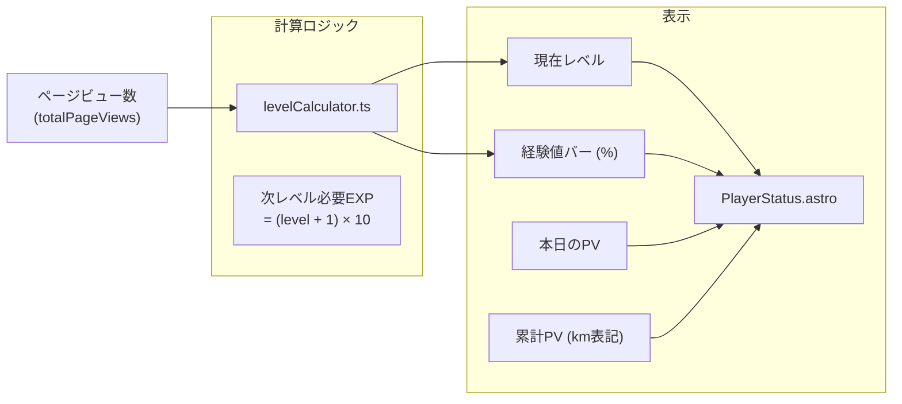
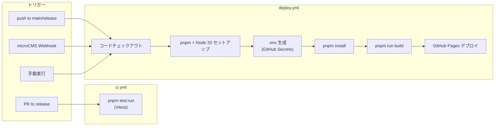
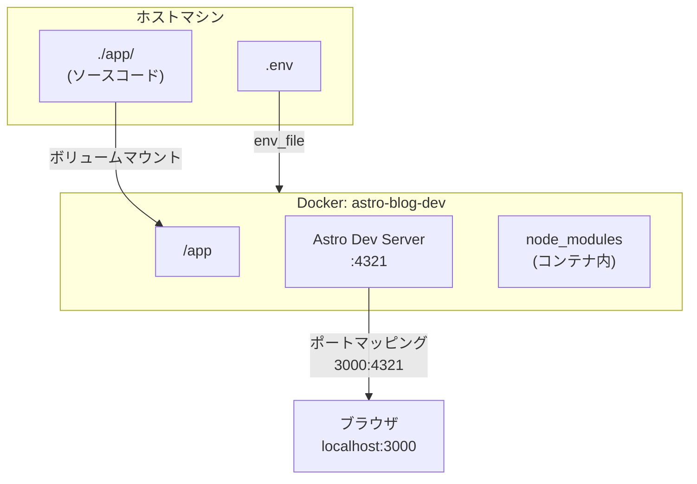
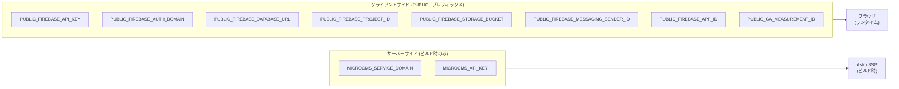

# CanPark アーキテクチャ概要

## 1. システム全体構成

## 2. ディレクトリ構成

## 3. コンポーネント構成

## 4. データフロー

## 5. 訪問者ステータス (ゲーミフィケーション)

## 6. CI/CD パイプライン

## 7. Docker 開発環境

## 8. 技術スタック

| カテゴリ | 技術 | 用途 |
|---------|------|------|
| フレームワーク | Astro 4.13 | 静的サイト生成 (SSG) |
| 言語 | TypeScript | 型安全な開発 |
| CMS | microCMS | 記事コンテンツ管理 |
| データベース | Firebase Realtime DB | 訪問者統計の永続化 |
| アナリティクス | Google Analytics 4 | アクセス解析 |
| テスト | Vitest + Testing Library | ユニットテスト |
| コンテナ | Docker + Docker Compose | ローカル開発環境 |
| CI/CD | GitHub Actions | テスト・ビルド・デプロイ |
| ホスティング | GitHub Pages | 静的サイト配信 |
| パッケージ管理 | pnpm | 依存関係管理 |
| ドメイン | canpark.blog | カスタムドメイン |

## 9. 環境変数

